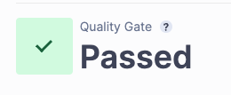

# :computer:  Actividades

## Pre-requisitos de la sesión en vivo :exclamation:

Para realizar este curso es importante tener instalado los siguientes programas:
* [JDK 11](https://www.oracle.com/java/technologies/downloads/)
* [Intellij Idea Community](https://www.jetbrains.com/idea/download/#section=windows)
* [Maven](https://maven.apache.org/download.cgi)
* [Cuenta de github.com](https://github.com/)

## Java línea de comando
Una vez que JDK y MAVEN sean instalados y configurados, procederemos a validar que estén bien instalados para comenzar con la actividad.

### PASO 1: Validar entorno
Abrimos una terminal y validamos si reconoce nuestra versión de Java:

``` bash
# Iniciamos validando que nuestra consola reconozca la versión de Java

jonathan.torres@Jonathans-MacBook-Pro LearningJava1.2 % java -version
java version "11.0.15" 2022-04-19 LTS
Java(TM) SE Runtime Environment 18.9 (build 11.0.15+8-LTS-149)
Java HotSpot(TM) 64-Bit Server VM 18.9 (build 11.0.15+8-LTS-149, mixed mode)

```

Ahora desde una terminal y validamos si reconoce nuestra versión de Maven:

``` bash
# Iniciamos validando que nuestra consola reconosca la versión de Java

jonathan.torres@Jonathans-MacBook-Pro BAZJAVA12022 % mvn -version
Apache Maven 3.8.5 (3599d3414f046de2324203b78ddcf9b5e4388aa0)
Maven home: /Users/jonathan.torres/Open/apache-maven-3.8.5
Java version: 11.0.15, vendor: Oracle Corporation, runtime: /Library/Java/JavaVirtualMachines/jdk-11.0.15.jdk/Contents/Home
Default locale: en_MX, platform encoding: UTF-8
OS name: "mac os x", version: "12.3.1", arch: "x86_64", family: "mac"
jonathan.torres@Jonathans-MacBook-Pro BAZJAVA12022 %
```

## Temario Día 5

### Cobertura de código

Cómo se define la cobertura de (pruebas) de código y sus objetivos

### JaCoCo

Librería principal de cobertura de pruebas para proyectos Java, instalación y configuración.

### SonarCloud

Herramienta de análisis estático, configuración e integración con JaCoCo

## Proyecto ejemplo
Se incluye un proyecto que ya se encuentra configurado y listo para ejecutar análisis de cobertura de código,
así como su integración con SonarCloud

1. Comenzamos con descargar/clonar lo que tengamos en el repositorio https://github.com/wizelineacademy/BAZJAVA12022 y nos vamos a la carpeta de (.6/Cobertura)

2. Desde IntelliJ importamos el proyecto maven, abriendo el pom.xml que se ubica bajo la carpeta de Cobertura

3. La ejecución de los módulos de prueba, con cobertura de código, se consigue ejecutando:
```
mvn clean install
```

4. Deberemos ver una salida, al finalizar la ejecución, similar a esta:
```
[INFO]
[INFO] Results:
[INFO]
[INFO] Tests run: 27, Failures: 0, Errors: 0, Skipped: 0
[INFO]
[INFO]
[INFO] --- maven-jar-plugin:3.2.2:jar (default-jar) @ springboot ---
[INFO] Building jar: /Users/orlandorincon/Documents/git/BAZJAVA12022/6/Cobertura/Cobertura/target/springboot-0.0.3-SNAPSHOT.jar
[INFO]
[INFO] --- spring-boot-maven-plugin:2.7.4:repackage (repackage) @ springboot ---
[INFO] Replacing main artifact with repackaged archive
[INFO]
[INFO] --- jacoco-maven-plugin:0.8.8:report (jacoco-site) @ springboot ---
[INFO] Loading execution data file /Users/orlandorincon/Documents/git/BAZJAVA12022/6/Cobertura/Cobertura/target/jacoco.exec
[INFO] Analyzed bundle 'springboot' with 4 classes
[INFO]
[INFO] --- jacoco-maven-plugin:0.8.8:check (jacoco-check) @ springboot ---
[INFO] Loading execution data file /Users/orlandorincon/Documents/git/BAZJAVA12022/6/Cobertura/Cobertura/target/jacoco.exec
[INFO] Analyzed bundle 'springboot' with 4 classes
[INFO] All coverage checks have been met.
[INFO]
[INFO] --- maven-install-plugin:2.5.2:install (default-install) @ springboot ---
[INFO] Installing /Users/orlandorincon/Documents/git/BAZJAVA12022/6/Cobertura/Cobertura/target/springboot-0.0.3-SNAPSHOT.jar to /Users/orlandorincon/.m2/repository/com/wizeline/springboot/0.0.3-SNAPSHOT/springboot-0.0.3-SNAPSHOT.jar
[INFO] Installing /Users/orlandorincon/Documents/git/BAZJAVA12022/6/Cobertura/Cobertura/pom.xml to /Users/orlandorincon/.m2/repository/com/wizeline/springboot/0.0.3-SNAPSHOT/springboot-0.0.3-SNAPSHOT.pom
[INFO] ------------------------------------------------------------------------
[INFO] BUILD SUCCESS
[INFO] ------------------------------------------------------------------------
[INFO] Total time:  13.513 s
[INFO] Finished at: 2022-09-30T15:20:12-05:00
[INFO] ------------------------------------------------------------------------
```

## Instrucciones para proyecto final (Capstone)
Incorporar cobertura de código con JaCoCo, y configurar su proyecto con SonarCloud

* El proyecto deberá cumplir con entre 75 y 80% de cobertura de código para cobertura por METODO y LINEA
* El proyecto deberá cumplir con 50% de cobertura de código para cobertura por RAMA
* El proyecto deberá configurarse y su Quality Gate cumplir con el estado **Passed** en SonarCloud


# :books: Para aprender más
* [Documentación JaCoCo (Inglés)](https://www.jacoco.org/jacoco/trunk/doc/)
* [Documentación SonarCloud (Inglés)](https://docs.sonarcloud.io/)
* [JaCoCo y SonarQube (Inglés)](https://www.baeldung.com/sonarqube-jacoco-code-coverage)

